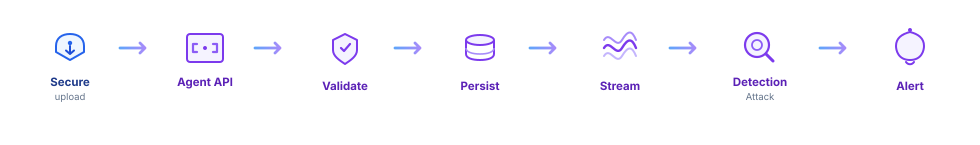

#  TrustEdge Agent API

**Ingest, validate, and stream endpoint telemetry for TrustEdge detection.**

A FastAPI service that accepts compressed batches from [TrustEdge-Agent](https://github.com/TrustEdgeOrg/TrustEdge-Agent), authenticates devices, persists events, and optionally publishes to Kafka for [TrustEdge](https://github.com/TrustEdgeOrg/TrustEdge).

[](https://github.com/TrustEdgeOrg/TrustEdge-Agent-API/actions/workflows/deploy-api.yml)

<p align="center">
  
</p>

---

## Why it exists

The agent needs a thin, reliable ingest front door — not a full SIEM. This API is that hop:

| This API | Hands off to |
|----------|--------------|
| Register devices · accept events · optional Kafka · live twin | [TrustEdge](https://github.com/TrustEdgeOrg/TrustEdge) (rules, behavior, AI activity, alerts, UI) |
| Pair with collectors on the endpoint | [TrustEdge-Agent](https://github.com/TrustEdgeOrg/TrustEdge-Agent) |

Built for local demos and AWS deploy: Python **3.12+**, FastAPI, optional stream publish.

---

## How it works

1. **Secure upload** — agents POST over HTTPS with a device bearer token.  
2. **Agent API** — register (`/v1/register`) and ingest (`/v1/events`).  
3. **Validate** — decompress zstd if needed; check auth, schema, and batch limits.  
4. **Persist** — keep devices / events on disk (or memory-only).  
5. **Stream** — optional publish to Kafka / Redpanda.  
6. **Live twin** — optional Redis device state when `REDIS_URL` is set (fail-open).  
7. **Detection** — TrustEdge rules, behavior, and AI activity analyze the stream.  
8. **Alert** — operators get notified in the TrustEdge UI.

Want the schemas? See [API reference](docs/api.md) · [Configuration](docs/configuration.md).

---

## Engineering highlights

| Area | Design choice |
|------|----------------|
| **Auth** | Optional enroll token on register; per-device bearer on ingest |
| **Ingress** | Single event or `{"events":[…]}` batch (max 100) |
| **Compression** | Accepts `Content-Encoding: zstd` with plain JSON fallback |
| **Persistence** | `devices.json` + `events.jsonl` under a configurable data dir |
| **Streaming** | Kafka publish when `KAFKA_BROKERS` is set; no-op otherwise |
| **Live twin** | Optional Redis twin (`REDIS_URL`) for live device presence / state |
| **TrustEdge registry** | Fail-open upsert to `/internal/agents/upsert` on register and ingest |
| **Safety** | `TRUSTEDGE_AGENT_PRODUCTION=1` requires enroll token |
| **Deploy** | Docker image → ECR → EC2 via GitHub Actions |

---

## Quick start

### Prerequisites

- Python **3.12+**
- Optional: Kafka / Redpanda if you want streaming

### Local API

```bash
git clone https://github.com/TrustEdgeOrg/TrustEdge-Agent-API.git
cd TrustEdge-Agent-API

pip install -r requirements-dev.txt
python -m app.main
```

With Kafka:

```bash
export KAFKA_BROKERS=127.0.0.1:9092
python -m app.main
```

Point an agent at it:

```bash
cd TrustEdge-Agent
export TRUSTEDGE_AGENT_API_URL=http://127.0.0.1:8080
# export TRUSTEDGE_AGENT_ENROLL_TOKEN=...   # if set on the API
go run ./cmd/trustedge-agent
```

Production checklist: `TRUSTEDGE_AGENT_PRODUCTION=1` + enroll token.  
Full knobs: [Configuration](docs/configuration.md).

---

## Project layout

```text
app/
  main.py                 FastAPI app + uvicorn lifespan
  config.py               Settings from environment
  dependencies.py         Store / settings wiring
  api/                    Routes, ingest decode, errors
  models/                 Pydantic request / response schemas
  store/                  Registration + event persistence
  publishers/             Optional Kafka publisher
  core/                   Auth, zstd codec, ids, constants
docs/                     API reference + configuration
tests/                    pytest suite
aws/                      ECR / EC2 deploy notes
```

---

## Develop

```bash
pip install -r requirements-dev.txt
make test
python -m app.main
```

| Doc | Purpose |
|-----|---------|
| [API reference](docs/api.md) | Endpoints, envelopes, event types |
| [Configuration](docs/configuration.md) | Every environment variable |
| [AWS deploy](aws/README.md) | ECR build and EC2 deploy |

---

## Ecosystem

| Repository | Role |
|------------|------|
| **[TrustEdge-Agent](https://github.com/TrustEdgeOrg/TrustEdge-Agent)** | Endpoint collector |
| **[TrustEdge-Agent-API](https://github.com/TrustEdgeOrg/TrustEdge-Agent-API)** | This ingest API |
| **[TrustEdge](https://github.com/TrustEdgeOrg/TrustEdge)** | Dashboard · rules · behavior · AI activity · alerts |
| **[TrustEdgeClient](https://github.com/TrustEdgeOrg/TrustEdgeClient)** | Optional VPN enroll client |

AWS production layout: [TrustEdge deploy docs](https://github.com/TrustEdgeOrg/TrustEdge/blob/main/docs/DEPLOY.md)

---

Part of [TrustEdgeOrg](https://github.com/TrustEdgeOrg) · Built with FastAPI.
